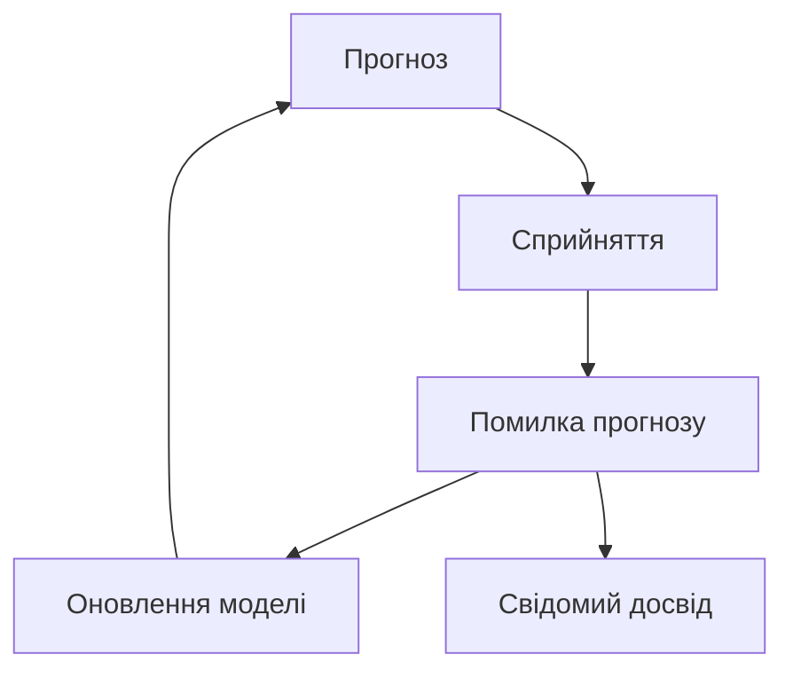
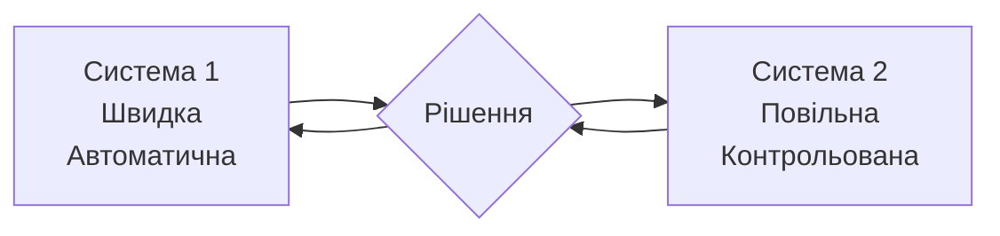
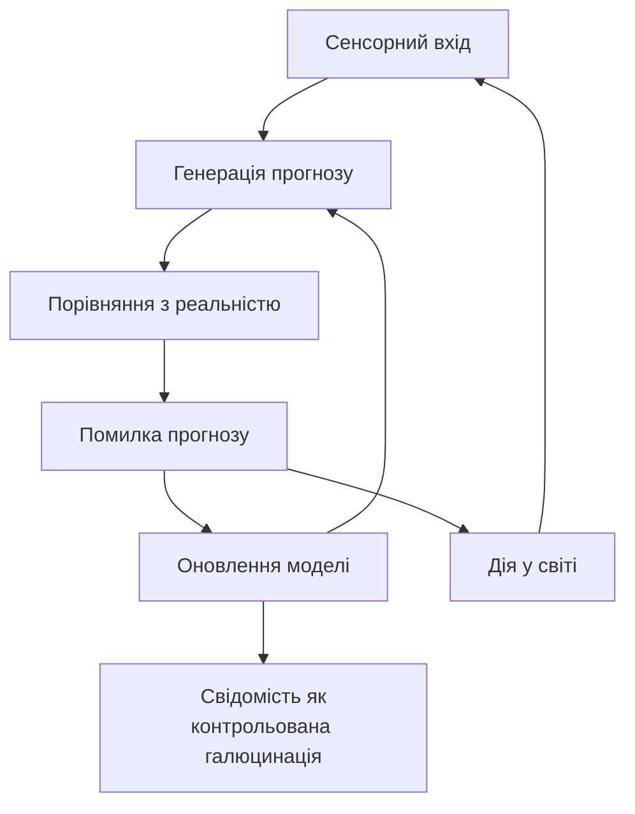
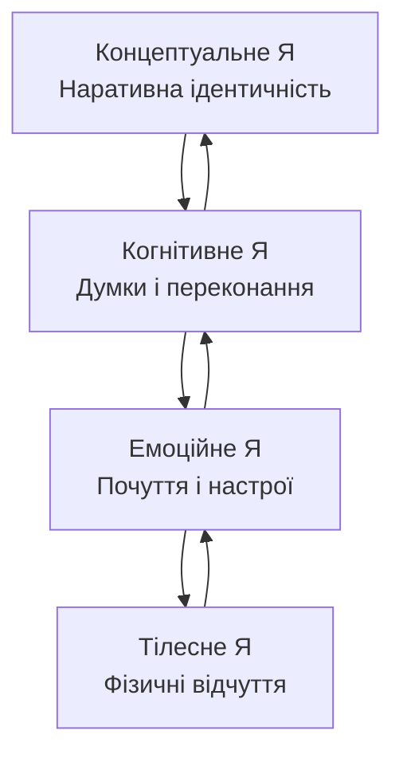
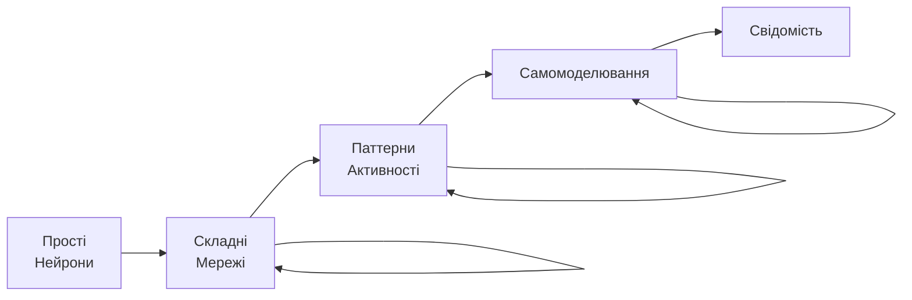
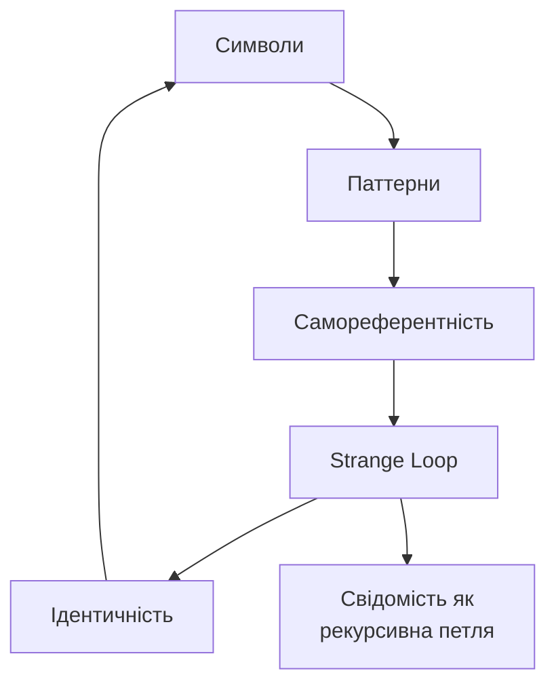

# Алгоритми свідомості: ключові концепції

## Цикл Предиктивної Обробки

Мозок постійно генерує прогнози про майбутні сенсорні сигнали і корегує їх на основі помилок. Свідомість виникає як побічний продукт цього процесу мінімізації несподіванок.

**Ключові елементи:**

- Постійне прогнозування
- Порівняння з реальністю
- Оновлення внутрішніх моделей
- Генерація суб'єктивного досвіду

## Подвійна Система Канемана

Людське мислення працює через дві системи: швидку інтуїтивну і повільну аналітичну. Їхня взаємодія створює складні поведінкові паттерни, які здаються ірраціональними, але насправді слідують алгоритмічним правилам.

| Система 1 | Система 2 |
|------------|-----------|
| Швидка | Повільна |
| Автоматична | Контрольована |
| Інтуїтивна | Аналітична |
| Енергоефективна | Енерговитратна |

## Принцип Вільної Енергії Фрістона

Всі живі системи мінімізують вільну енергію через баєсівську інференцію. Свідомість - це спосіб мозку контролювати цей процес, створюючи "контрольовану галюцинацію" реальності.

**Механізми:**

- Сенсорне прогнозування
- Активне семплування середовища
- Ієрархічна обробка сигналів
- Мінімізація surprise

## Ієрархія Самомоделювання

Свідомість будується у вигляді ієрархії самомоделей від базових тілесних відчуттів до складних концептуальних уявлень про себе. Кожен рівень впливає на інші через зворотні зв'язки.

**Рівні ієрархії:**

1. Тілесне Я - інтероцепція і відчуття
2. Емоційне Я - настрої і афекти
3. Когнітивне Я - думки і переконання
4. Концептуальне Я - наративна ідентичність

## Емерджентність Свідомості

Складні властивості виникають з простих компонентів через нелінійні взаємодії. Свідомість емержує коли система досягає критичної складності і починає моделювати саму себе.

**Етапи емерджентності:**

- Прості елементи (нейрони)
- Мережева організація
- Паттерни активності
- Самомоделювання
- Свідомий досвід

## Strange Loop Хофштадтера

Свідомість виникає через самореферентні петлі у символьних системах. "Я" - це не сутність, а паттерн, що посилається сам на себе, створюючи ілюзію центрального спостерігача.

Ключова ідея: немає гомункула у голові, є тільки рекурсивні процеси, що створюють відчуття "бути кимось".

## Висновки

Ці діаграми ілюструють головний висновок сучасної науки про свідомість: **немає містичних компонентів**. Свідомість виникає з математично описуваних алгоритмічних процесів, які можуть бути реалізовані як у біологічних, так і штучних системах.
